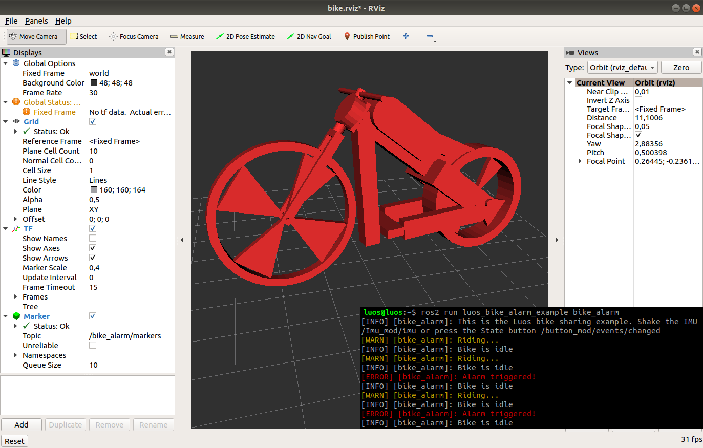

[](https://luos.io)

# Luos ROS example: Bike sharing example

This is a Luos example using ROS2, the bike sharing application:

* The bike pops up in steady green when it's idle
* Agitate the imu when it's idle, it's being stolen, the RGB alarm flashes in red
* Press the state button to acknowledge the alarm
* Press again to start riding, the bike slighly blinks in green
* Press a new time to stop riding, it becomes idle again



## Get started in ROS2

This example ROS2 package relies on `luos_interface`, make sure you first installed it by following [its own procedure](https://github.com/aubrune/luos_ros2#install-ros-2-and-luos).

Then, download the example package and compile it with `colcon`:
```
~/ros2_ws/src/$ git clone https://github.com/aubrune/luos_bike_alarm_example.git

~/ros2_ws/$ colcon build --symlink-install    # Build the ROS workspace
~/ros2_ws/$ source ~/.bashrc                  # Source all new launches messages and resources
```

Plug at least a Luos Imu node and gate to your computer, as well as optional RGB and State modules. The expected Luos modules' aliases are the default, if they're not, update the [topic names](./luos_bike_alarm_example/bike_alarm.py#L12) with your custom aliases.

Then, start the bike example from its launchfile:
```
~/ros2_ws/$ ros2 launch luos_bike_alarm_example example.launch.py
```

RViz2 will pop up and show a bike, agitate the Luo Imu node in order to update the RViz2 view in real time. If the bike shows but does not actuate, make sure that Imu data comes from the expected topic `/Imu_mod/imu`, or change the topic name.

[](https://community.luos.io)
[](https://docs.luos.io)
